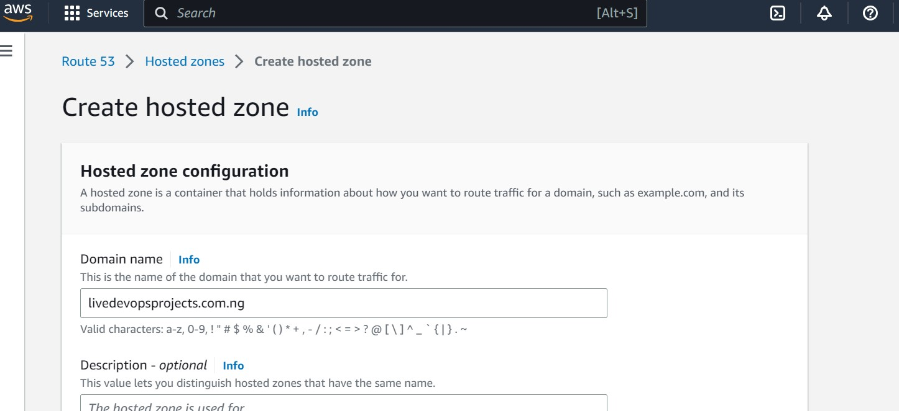
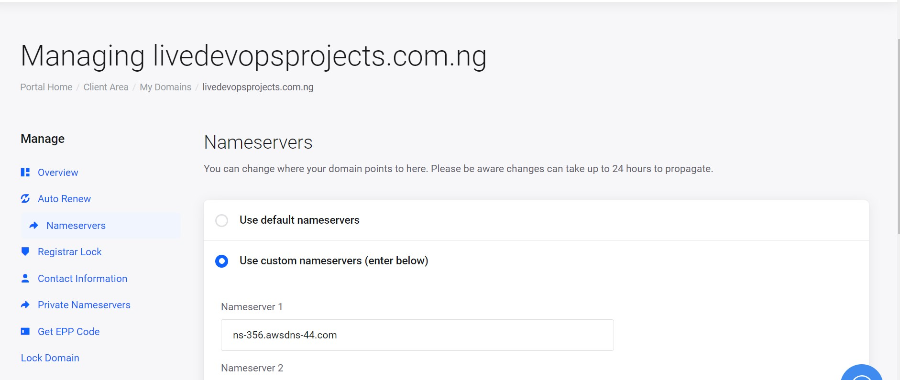

# Kingsley Documentation of Project 10

## Task

### This project consists of two parts:

1. Configure Nginx as a Load Balancer

2. Register a new domain name and configure secured connection using SSL/TLS certificates

### PROJECT 10: Load Balancer Solution With Nginx and SSL/TLS

### Step 1 - Configure Nginx as a Load Balancer

1. Create an EC2 VM based on Ubuntu Server 20.04 LTS and name it Project10-nginx-lb (do not forget to open TCP port 80 for HTTP connections, also open TCP port 443 – this port is used for secured HTTPS connections)

2. Update /etc/hosts file for local DNS with Web Servers’ names (e.g. Web1 and Web2) and their local IP addresses

`sudo vi /etc/hosts`

3. Install and configure Nginx as a load balancer to point traffic to the resolvable DNS names of the webservers

*Update the instance and Install Nginx*

`sudo apt update`

`sudo apt install nginx`

*Configure Nginx LB using Web Servers’ names defined in /etc/hosts*

### Open the default nginx configuration file

`sudo vi /etc/nginx/nginx.conf`

#insert following configuration into http section

` upstream myproject {
    server Web1 weight=5;
    server Web2 weight=5;
  }

server {
    listen 80;
    server_name www.domain.com;
    location / {
      proxy_pass http://myproject;
    }
  }

#comment out this line
#include /etc/nginx/sites-enabled/*;`

*Restart Nginx and make sure the service is up and running*

`sudo systemctl restart nginx`

`sudo systemctl status nginx`

### Step 2 - Register a new domain name and configure secured connection using SSL/TLS certificates.

1. Register a new domain name with any registrar of your choice in any domain zone (e.g. .com, .net, .org, .edu, .info, .xyz or any other)

2. Assign an Elastic IP to your Nginx LB server and associate your domain name with this Elastic IP

3. Create hosted zone through Route 53 on AWS - a public hosted zone determines how traffic is routed to the internet.

4. Connect Route 53 hosted zone to domain - copy nameservers from route 53 to domain nameservers

5. Update A record in the registrar to point to Nginx LB using Elastic IP address

