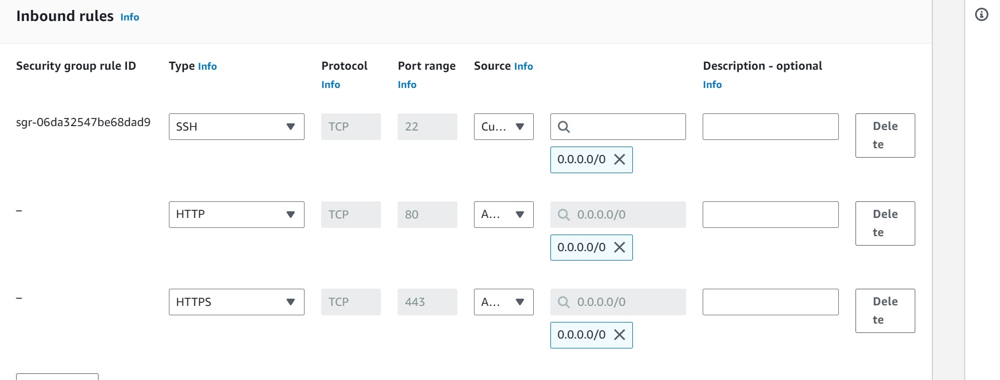
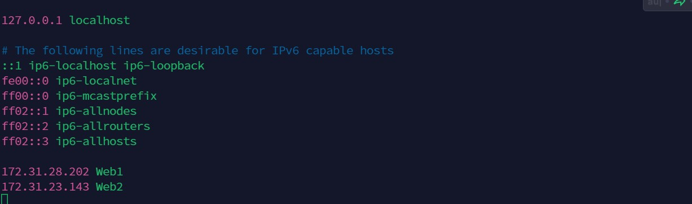
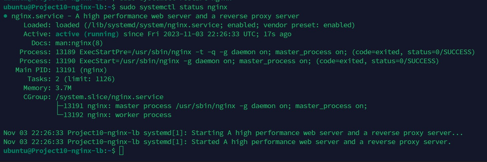

# Kingsley Documentation of Project 10

## Task

### This project consists of two parts:

1. Configure Nginx as a Load Balancer

2. Register a new domain name and configure secured connection using SSL/TLS certificates

### PROJECT 10: Load Balancer Solution With Nginx and SSL/TLS

### Steps:

1. Create an EC2 VM based on Ubuntu Server 20.04 LTS and name it Project10-nginx-lb (do not forget to open TCP port 80 for HTTP connections, also open TCP port 443 – this port is used for secured HTTPS connections)

2. Update /etc/hosts file for local DNS with Web Servers’ names (e.g. Web1 and Web2) and their local IP addresses

`sudo vi /etc/hosts`

3. Install and configure Nginx as a load balancer to point traffic to the resolvable DNS names of the webservers

*Update the instance and Install Nginx*

`sudo apt update`

`sudo apt install nginx`

*Configure Nginx LB using Web Servers’ names defined in /etc/hosts*

### Open the default nginx configuration file

`sudo vi /etc/nginx/nginx.conf`

#insert following configuration into http section

` upstream myproject {
    server Web1 weight=5;
    server Web2 weight=5;
  }

server {
    listen 80;
    server_name www.domain.com;
    location / {
      proxy_pass http://myproject;
    }
  }

#comment out this line
#include /etc/nginx/sites-enabled/*;`

*Restart Nginx and make sure the service is up and running*

`sudo systemctl restart nginx`

`sudo systemctl status nginx`

